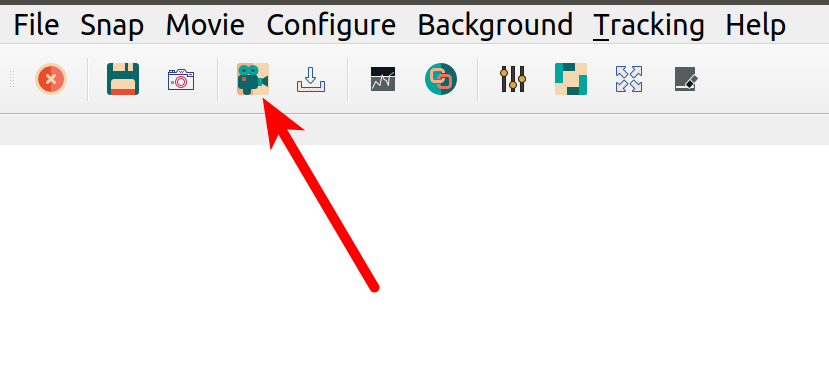

.. _getting_started:

Getting Started
===============
In order to familiarize yourself with the program, the best idea is to start with simulated data. In this way you avoid
all the problems arising from interfacing with a real instrument and you can see the limitations of the program. The
example config available on the repository is already configured to work with a simulated camera. It is recommended that
you copy the contents of the file into a folder on your own computer.

Opening the Program
-------------------
After :ref:`installing` PyNTA, you can trigger it from the command line. You can simply run the following command:

.. code-block:: bash

    pynta

After a few moments, a screen like the one below will welcome you to the program.

.. figure:: media/screenshot_01.png
   :alt: screenshot

This will use synthetic data by default, i.e. you can snap or acquire a movie and test the capabilities of the program without the need of connecting with a real camera. Once you are confident with the program and you would like to start using real hardware, you need to develop :ref:`a proper config file <example-config>`. Once you have it, you can run the following command:

.. code-block:: bash

    python -m pynta -c config.yml

You can reproduce the config file that gives you the synthetic data and then move to real devices.

The Tools
---------
Most of the options were designed to be self-explanatory. However it is important to give a short discussion in order to
speed the introduction to the tool. After initializing, normally one would like to snap a photo in order to see what is being recorded by the camera. You can achieve it by clicking the button as shown in the image below:

.. figure:: media/screenshot_snap.png
    :alt: Snap an Image

This will record a single image from the camera and will be displayed on the space right below:

.. figure:: media/screenshot_particles.png
    :alt: Simulated particles on the camera

The image can be zoomed-in and out by scrolling with the central wheel of the mouse. Dragging allows to move around the image. In order to return to the full view, it is possible to right-click on the image and select ``View All``. The histogram on the right of the image shows the levels for displaying. You can adjust the minimum and maximum as well as the color scale. Right clicking on the image allows you to do an ``Auto Range``, i.e. to adjust the levels such that the maximum and minimum correspond to those of the data being displayed.

If you want to save the image you can click on the icon for saving, as shown below:

.. figure:: media/screenshot_save_image.png
    :alt: Simulated particles on the camera

PyNTA also allows you to acquire continuous images, by clicking on the icon highlighted below. The exact behaviour will depend on the camera employed. For example, if a frame-grabber is available, the exact timing between frames can be guaranteed. Cameras without a buffer, however, will have a timing that depends on the computer ability to read from them. The communication with the camera happens in a separate thread, trying to guarantee the maximum reliability of the timing.

Another feature is the continuous saves option, which is right next to the start movie button. The continuous saves streams all the available frames to a file on the hard rive. The location of the file is determined in the config file or, as we will see later, can be set in the configuration on the User Interface. In case of acquiring at high frame rates, not all frames are displayed to the user, but all of them will be saved.

Tracking and Linking
--------------------
.. figure:: media/screenshot_tracking.png
    :alt: Screenshot tracking options

The feature that really makes PyNTA unique is the ability to identify and track nanoparticles on a video in real time.
The procedure for tracking and analysis requires of two steps. First, you have to start identifying the particles, with
the button called ``start tracking``. You will see red crosses appearing on the particles in the image. It takes a few instants to setup the linking procedure, during which the movie may seem to freeze.

If you are satisfied with how the identification of particles works, you can start linking the positions. Linking is a procedure that identifies whether locations in consecutive frames belong to the same particle or not. This procedure can be computationally expensive and requires fine tuning of the parameters. Linking also happens in a separate process, and in parallel to the acquisition and identification of particles.